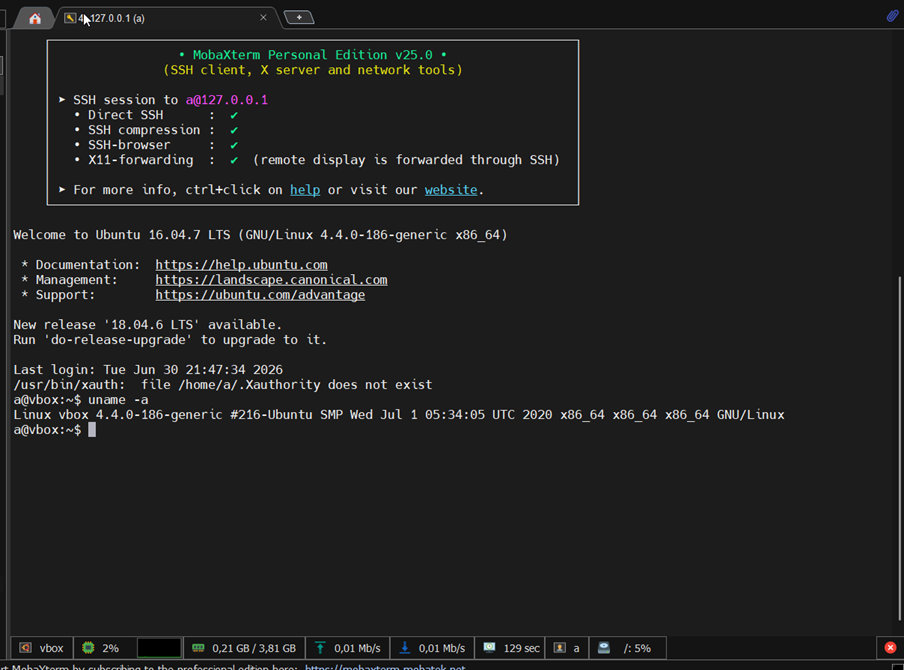
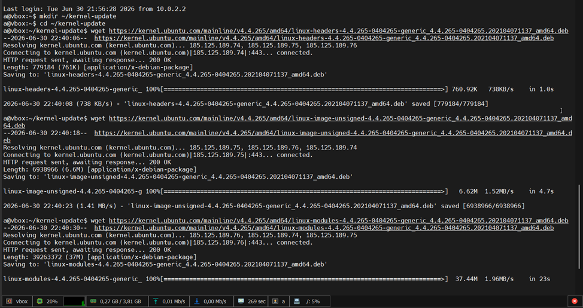
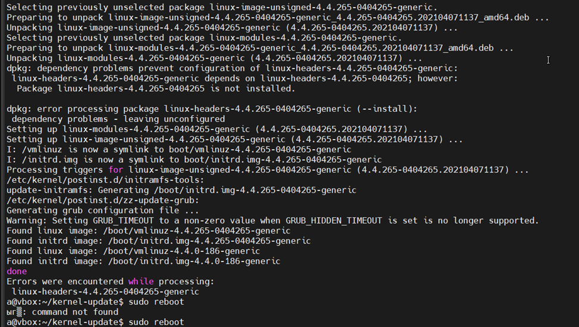
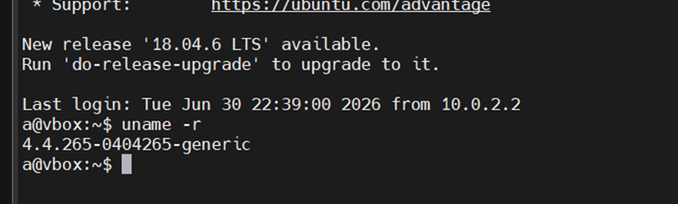

# Обновление ядра Linux

Занятие 1. Обновление ядра системы

Цель домашнего задания
Научиться обновлять ядро в ОС Linux.
Описание домашнего задания
1) Запустить ВМ c Ubuntu.
2) Обновить ядро ОС на новейшую стабильную версию из mainline-репозитория.
3) Оформить отчет в README-файле в GitHub-репозитории.

Для выполнения домашнего задания была использована используется Ubuntu 16.04

Команды, которые использовались для обновления:
uname -r  - узнать актуальную версия ядра

'> 4.4.0-186-generic

>

mkdir ~/kernel-update && cd ~/kernel-update - создать директорию и перейти в нее

Установка пакетов ядра:
wget https://kernel.ubuntu.com/mainline/v4.4.265/amd64/linux-headers-4.4.265-0404265-generic_4.4.265-0404265.202104071137_amd64.deb

wget https://kernel.ubuntu.com/mainline/v4.4.265/amd64/linux-image-unsigned-4.4.265-0404265-generic_4.4.265-0404265.202104071137_amd64.deb 

wget https://kernel.ubuntu.com/mainline/v4.4.265/amd64/linux-modules-4.4.265-0404265-generic_4.4.265-0404265.202104071137_amd64.deb

'> (у всех длинный вывод, тк выгрузка с репозитория )

>

sudo dpkg -i *.deb

'> (длинный вывод, установка всех пакетов)

>

sudo reboot 

'> (ребут системы)

После ребута системы была выполнена команда uname -r

>