# Работа с mdadm. Сборка RAID массивов

**Занятие 2.** Работа с mdadm

---

Задание
- Добавить в виртуальную машину несколько дисков
- Собрать RAID-0/1/5/10 на выбор
- Сломать и починить RAID
- Создать GPT таблицу, пять разделов и смонтировать их в системе.

---

Для выполнения домашнего задания была использована используется Ubuntu 22.04

1) Добавить в виртуальную машину несколько дисков
Перед началом работы, на виртуальную машину было добавлено еще 4 диска для создания RAID массива 

>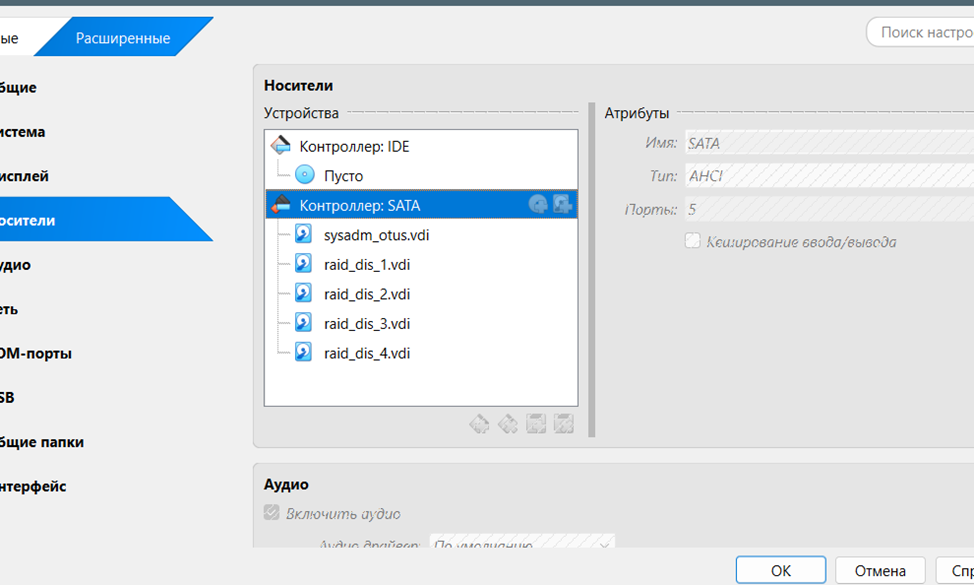

В запущенной системе выподняю команду:

```bash
sudo lshw -short | grep disk
```

для отображени аппаратных компонентов на виртуальной машине

>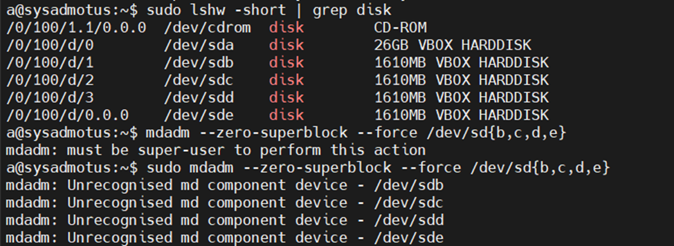

2) Собрать RAID-0/1/5/10 на выбор

Далее на виртуальной машине был собран RAID 10
>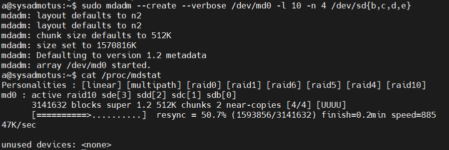

Для сборки raid массива из нескольки дисков была выполнена команда:

```bash
sudo mdadm --create --verbose /dev/md0 -l 10 -n 4 /dev/sd{b,c,d,e}
```

После сборки RAID массивы выполняю команду:

```bash
sudo mdadm -D /dev/md0
```

>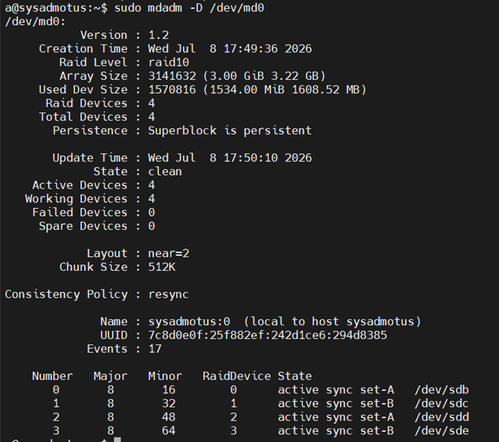

3) Сломать и починить RAID

Для выполнения данного задания, мы ломаем один из виртуальных дисков, для этого выполняем команду:

```bash
sudo mdadm /dev/md127 --fail /dev/sde
```

>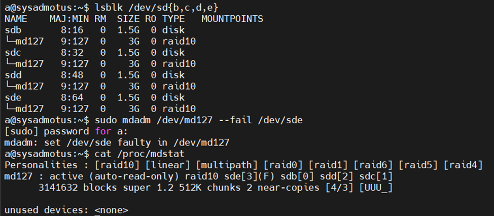 

После этого повторно выполнил команду:

```bash
sudo mdadm -D /dev/md127
```

для того, что бы проанализировать состояние RAID массива

> 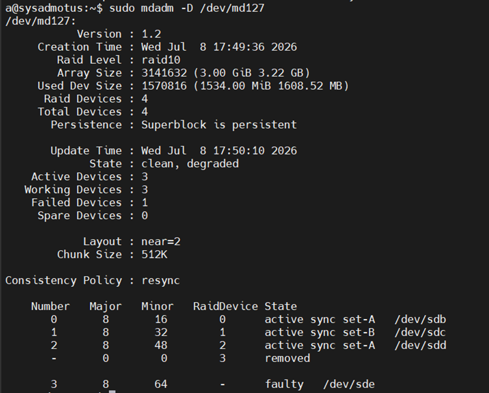

После этого выполняются команды:

```bash
sudo mdadm /dev/md127 --remove /dev/sde
sudo mdadm /dev/md127 --add /dev/sde
```

где сперва мы удаляем диск из RAID массива, а после добавляем новый 

> 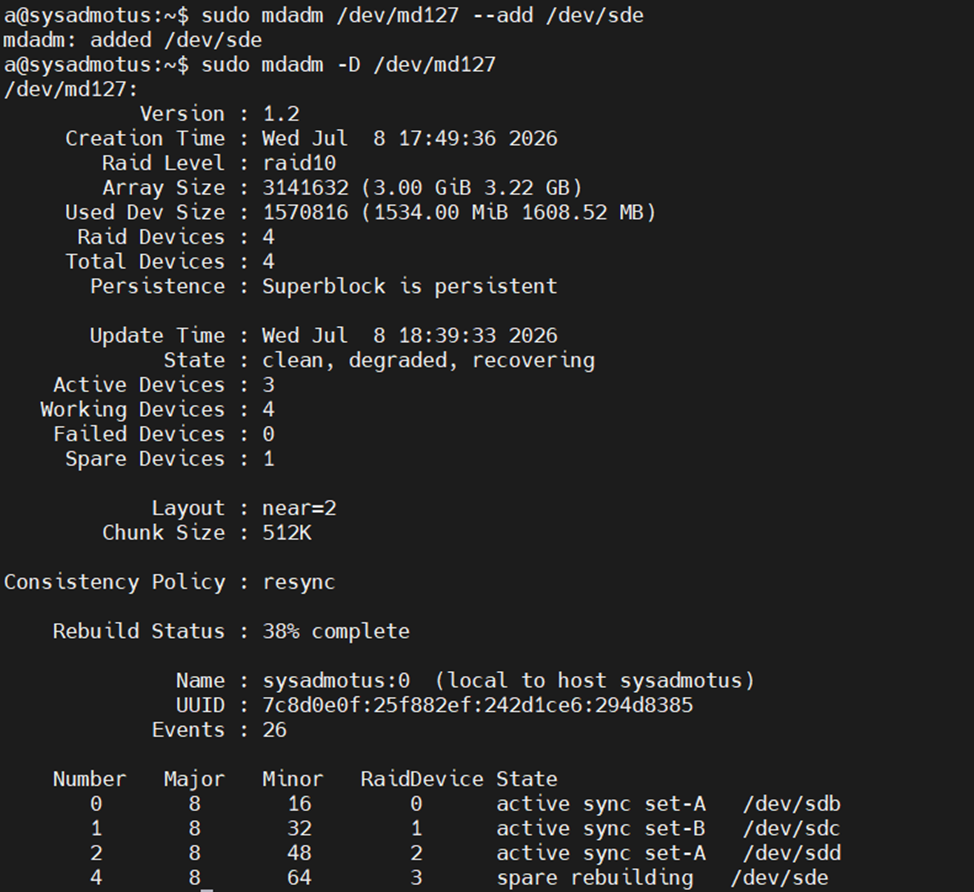

а так же после проведения востановительных работы, повторно выполняем команду анализа RAID массива

> 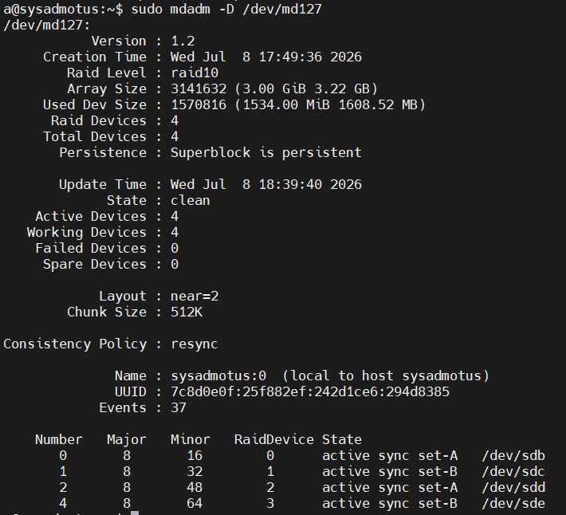

4) Создать GPT таблицу, пять разделов и смонтировать их в системе.

Для создания GPT таблицы, требуется выполнить команды:

Создание раздела GPT на RAID массиве

```bash
parted -s /dev/md127 mklabel gpt 
```

а далее создаем партиции

```bash
parted /dev/md127 mkpart primary ext4 0% 20%
parted /dev/md127 mkpart primary ext4 20% 40%
parted /dev/md127 mkpart primary ext4 40% 60%
parted /dev/md127 mkpart primary ext4 60% 80%
parted /dev/md127 mkpart primary ext4 80% 100%
```

>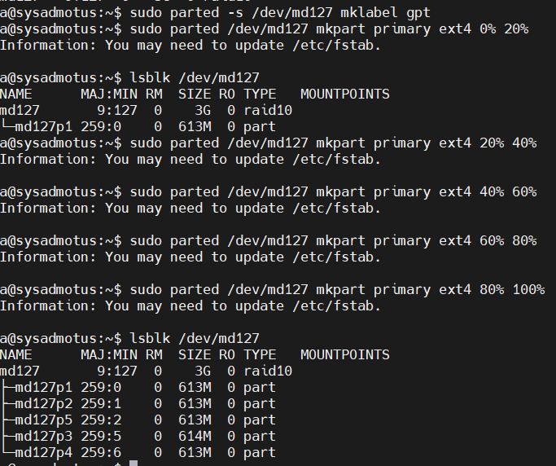

Для проверки GPT таблицы, создадим файловые хранилища 

```bash
for i in $(seq 1 5); do sudo mkfs.ext4 /dev/md127p$i; done
mkdir -p /raid/part{1,2,3,4,5}
for i in $(seq 1 5); do mount /dev/md127p$i /raid/part$i; done
```

>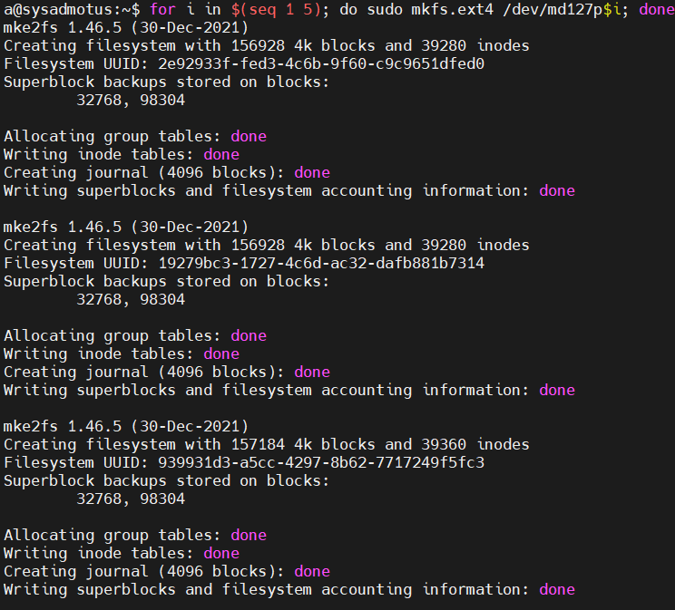
>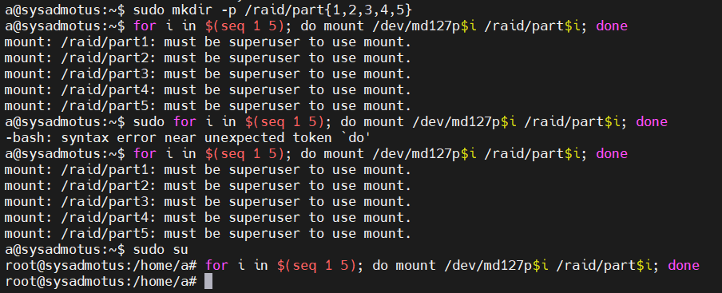

После чего, через WinSCP я проверяю эти директории на машине

>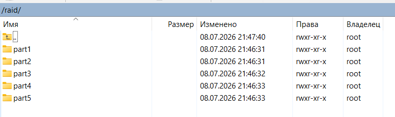