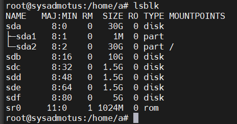
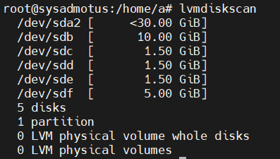
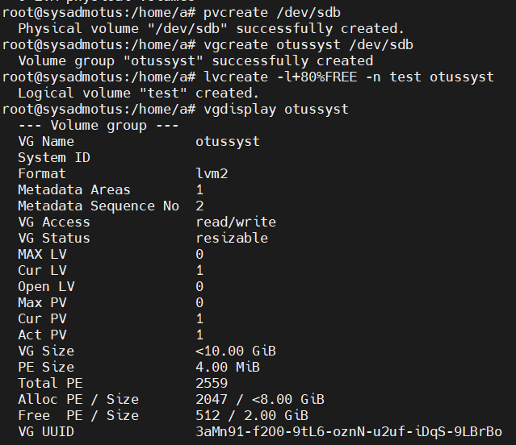
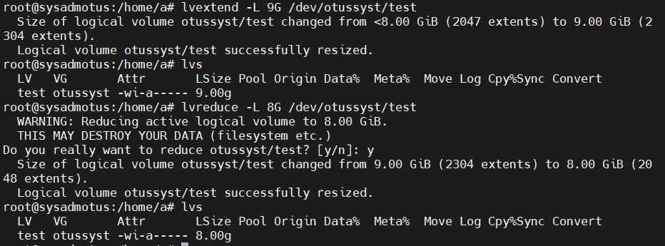
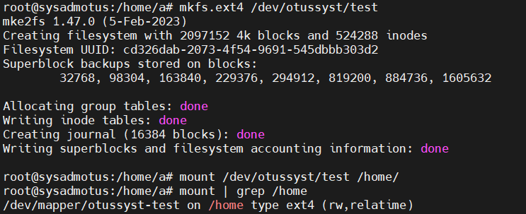
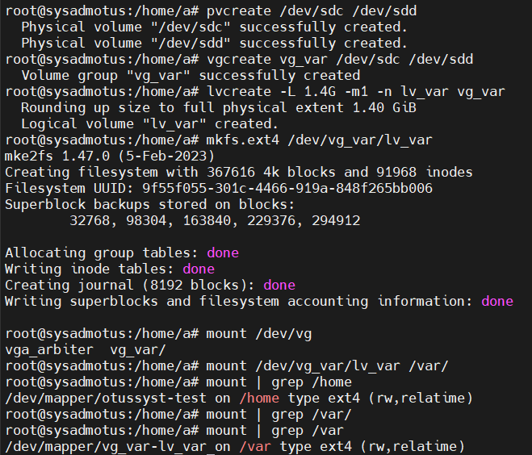
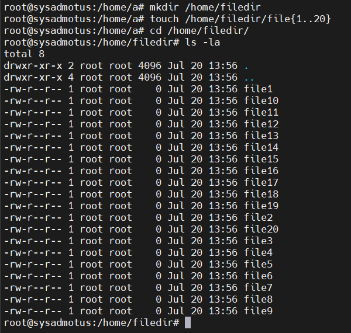
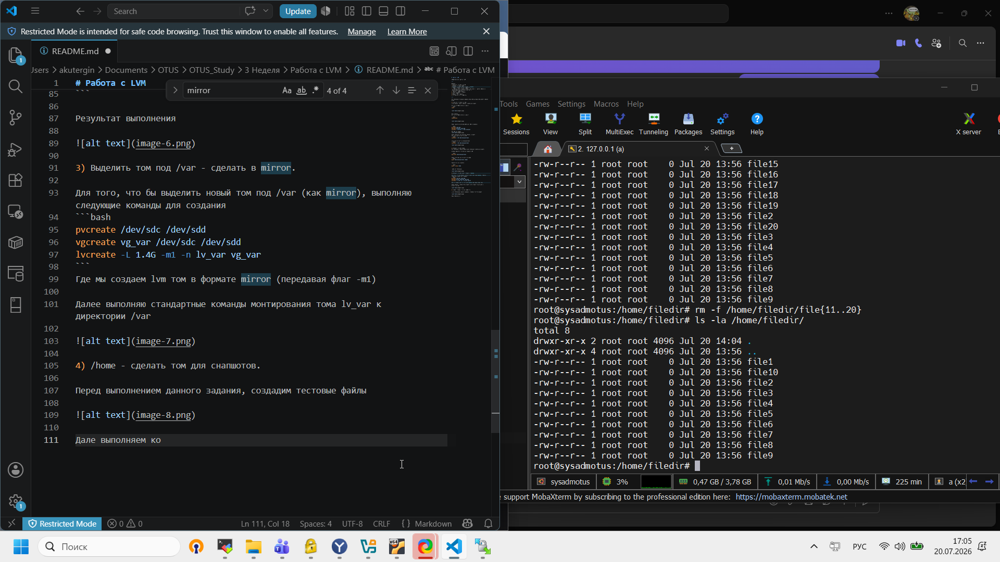
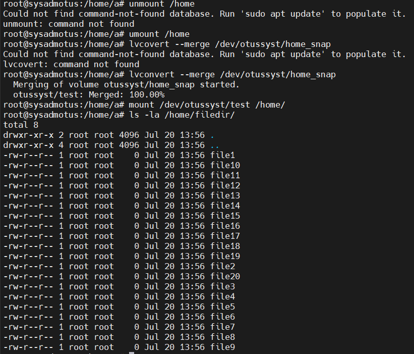
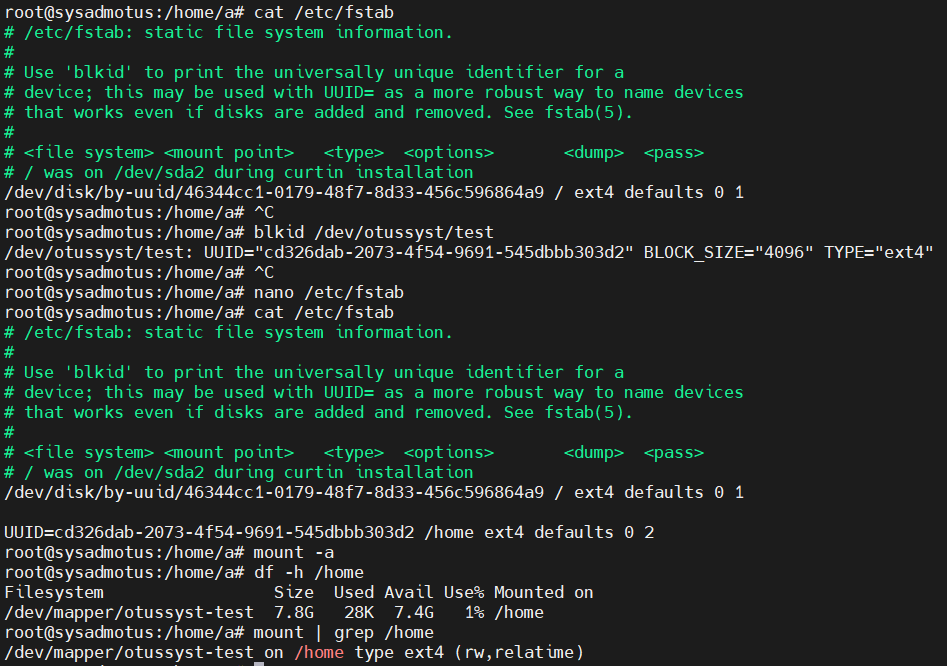

# Работа с LVM

**Занятие 3.** Работа с LVM

---

Задание
- Уменьшить том под / до 8G.
- Выделить том под /home.
- Выделить том под /var - сделать в mirror.
- /home - сделать том для снапшотов.
- Прописать монтирование в fstab. Попробовать с разными опциями и разными файловыми системами (на выбор).
- Работа со снапшотами:
* сгенерить файлы в /home/;
* снять снапшот;
* удалить часть файлов;
* восстановиться со снапшота.

---

Для выполнения домашнего задания была использована используется Ubuntu 24.04

1) Уменьшить том под / до 8G.
Перед началом работы выполняю следующие команды 

Смотрим доступные диски и размеры

```bash
lsblk
```




Или командой 
Смотрим доступные диски и размеры

```bash
lvmdiskscan
```



Далее разметим на дисках будующего LWM, командами:

```bash
pvcreate /dev/sdb
vgcreate otussyst /dev/sdb
lvcreate -l+80%FREE -n test otussyst
```
Где сперва создаем  


Далее выполняем для практики выполняю команды 
Для расширения директории LVM
```bash
lvextend -L 9G /dev/otussyst/test
```

Уменьшения директории otussyst/test
```bash
lvextend -L 9G /dev/otussyst/test
```



2) Выделить том под /home.
Для выполнени я данной задачи были выполнены следующие команды:

Создаем файловую систему на созданном LVM

```bash
mkfs.ext4 /dev/otussyst/test
```

Далее монтируем ее к директории /home
```bash
mount /dev/otussyst/test /home/
```

Далее проверяем командой 

```bash
mount | grep /home
```

Результат выполнения




3) Выделить том под /var - сделать в mirror.

Для того, что бы выделить новый том под /var (как mirror), выполняю следующие команды для создания 

```bash
pvcreate /dev/sdc /dev/sdd
vgcreate vg_var /dev/sdc /dev/sdd
lvcreate -L 1.4G -m1 -n lv_var vg_var
```
Где мы создаем lvm том в формате mirror (передавая флаг -m1)

Далее выполняю стандартные команды монтирования тома lv_var к директории /var




4) /home - сделать том для снапшотов.

Перед выполнением данного задания, создадим тестовые файлы



Далее создаем снапшот командой 

```bash
lvcreate -L 500m -s -n home_snap /dev/otussyst/test
```

так же тут удаляем часть файлов для того, что бы востановить снапшот



Далее востанавливаем наши файлы из снапшота 

```bash
lvcovert --merge /dev/otussyst/home_snap
mount /dev/otussyst/test /home/
```



Так же проверяем как востановились файлы после востановления снапшота 


5) Прописать монтирование в fstab. Попробовать с разными опциями и разными файловыми системами (на выбор).
Для выполнения этой задачи выполняем следующие команды 

```bash
cat /etc/fstab

blkid /dev/otussyst/test

mount -a
df -h /home
mount | grep /home
```

в которых мы узнаем содержимое файла fstab, после этого прописываем UUID нашего LVM. После этих команд проверяем как смонтированы директории 

