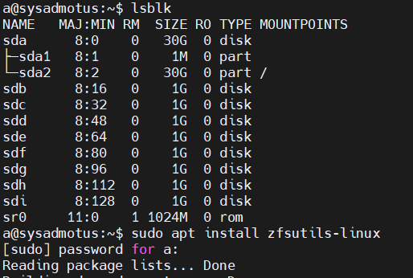
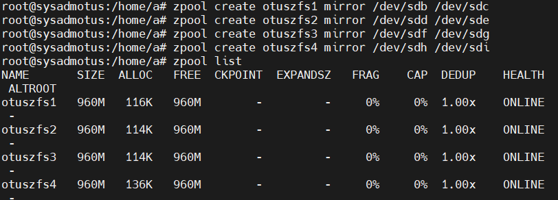
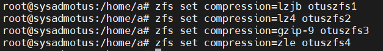
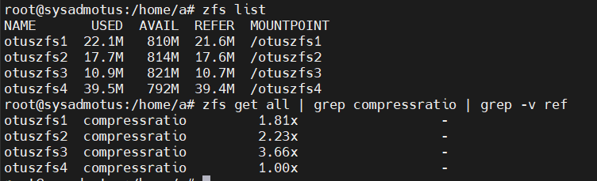
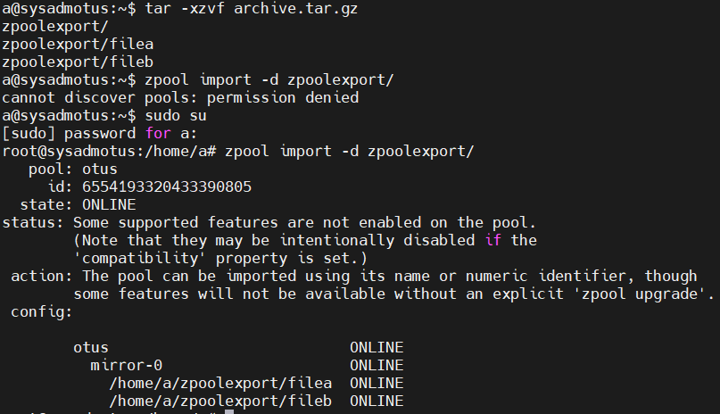
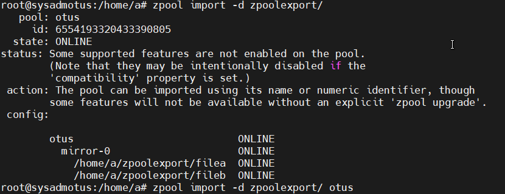
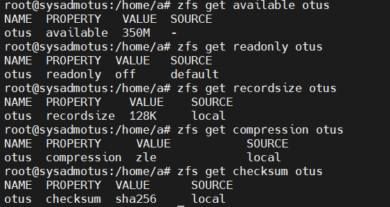
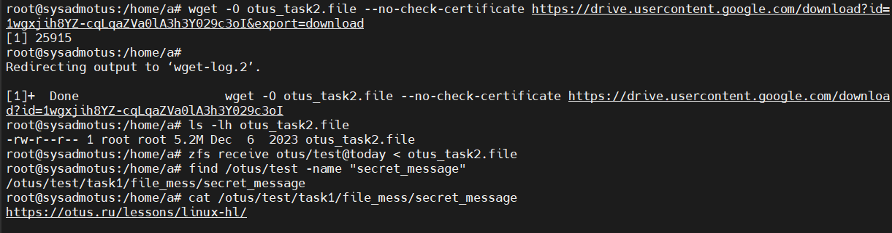

# Работа с ZFS

**Занятие 4.** Работа с ZFS

---

Задание
Определить алгоритм с наилучшим сжатием:
* Определить какие алгоритмы сжатия поддерживает zfs (gzip, zle, lzjb, lz4);
* создать 4 файловых системы на каждой применить свой алгоритм сжатия;
* для сжатия использовать либо текстовый файл, либо группу файлов.
Определить настройки пула.
С помощью команды zfs import собрать pool ZFS.
Командами zfs определить настройки:
* размер хранилища;
* тип pool;
* значение recordsize;
* какое сжатие используется;
* какая контрольная сумма используется.
Работа со снапшотами:
* скопировать файл из удаленной директории;
* восстановить файл локально. zfs receive;
* найти зашифрованное сообщение в файле secret_message.


---

Для выполнения домашнего задания была использована используется Ubuntu 24.04

1) Определить алгоритм с наилучшим сжатием
Перед началом работы, проверяю диски, которые есть на ВМ а так же устанавливаем утилиту для ZFS 

Команда для установки утилиты для ZFS

```bash
sudo apt install zfsutils-linux
```

Результат проверки и установки прикреплен ниже



Далее создаем 4 пула RAID1 для выполнения задачи, выполняя команды

```bash
zpool create otuszfs1 mirror /dev/sdb /dev/sdc
zpool create otuszfs2 mirror /dev/sdd /dev/sde
zpool create otuszfs3 mirror /dev/sdf /dev/sdg
zpool create otuszfs4 mirror /dev/sdh /dev/sdi
```

Результат создания пулов



Далее для каждого пула создаем алгоритмы зжатия данных для всех новых ФС
Выполняем следующие команды

```bash
zfs set compression=lzjb otuszfs1
zfs set compression=lz4 otuszfs2
zfs set compression=gzip-9 otuszfs3
zfs set compression=zle otuszfs4
```



Для проверки работы алгоритмов, выполняем команду для создания файлов

```bash
for i in {1..4}; do wget -P /otuszfs$i https://gutenberg.org/cache/epub/2600/pg2600.converter.log; done
```

После загрузки файла во все 4 пула, проверяем на сколько они были сжаты командами

```bash
zfs list
zfs get all | grep compressratio | grep -v ref
```

Результат выполнения команды




2) Определить настройки пула. С помощью команды zfs import собрать pool ZFS.

Перед выполнением задания, скачаем архив после чего разархивируем его 

```bash
wget -O archive.tar.gz --no-check-certificate 'https://drive.usercontent.google.com/download?id=1MvrcEp-WgAQe57aDEzxSRalPAwbNN1Bb&export=download'
```

После разархивации, проверим, возможно ли импортировать скаченный каталог в пул, командой:

```bash
zpool import -d zpoolexport/
```



После проверки пула, импортируем его в ОС, командой

```bash
zpool import -d zpoolexport/ otus
```



Далее узнаем размер импортированного пула:

```bash
zfs get available otus
```

тип:

```bash
zfs get readonly otus
```

Значение recordsize

```bash
zfs get recordsize otus
```

тип сжатия:

```bash
zfs get compression otus
```

и тип контрольной суммы:

```bash
zfs get checksum otus
```




3) Работа со снапшотами

Перед выполнением данной задачи, скачиваем тестовый снапшот и востанавливаем ФС командой:

```bash
zfs receive otus/test@today < otus_task2.file
```

после востановления проверяем содержимое файла

