# Работа с NFS

**Занятие 5.** Работа с NFS

---

Основная часть:
 - запустить 2 виртуальных машины (сервер NFS и клиента);
 - на сервере NFS должна быть подготовлена и экспортирована директория; 
 - в экспортированной директории должна быть поддиректория с именем upload с правами на запись в неё; 
 - экспортированная директория должна автоматически монтироваться на клиенте при старте виртуальной машины (systemd, autofs или fstab — любым способом);
 - монтирование и работа NFS на клиенте должна быть организована с использованием NFSv3.


Для самостоятельной реализации:
 - настроить аутентификацию через KERBEROS с использованием NFSv4.

---


1) запустить 2 виртуальных машины (сервер NFS и клиента);
Для выполнения работы было развернуто 2 ВМ на базе Ubuntu 24.04
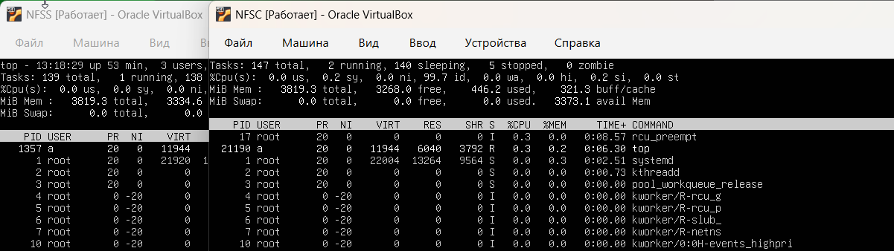

Также 2 виртуальных машины были соединены одной локальной сетью, для настройки NFS
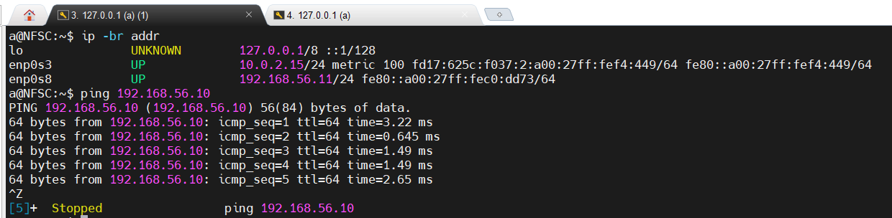

2) на сервере NFS должна быть подготовлена и экспортирована директория;
На NFS-сервере создаем директории, для дальнейшего экспортирования 

Перед началом работы, установим пакет NFS сервера

```bash
apt install nfs-kernel-server
```

После чего создаем директорию upload следующими командами

```bash
mkdir -p /srv/share/upload
chown -R nobody:nogroup /srv/share
chmod 0777 /srv/share/upload
```

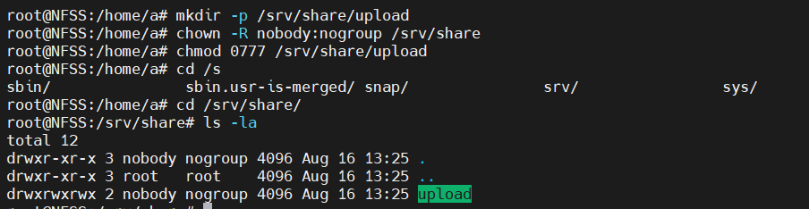

3) в экспортированной директории должна быть поддиректория с именем upload с правами на запись в неё;
Экспортируем директорию в файл /etc/exports, командой 

```bash
cat << EOF > /etc/exports 
/srv/share 192.168.56.11/32(rw,sync,root_squash)
EOF
```

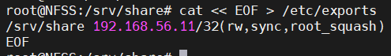

Далее экспортируем директорию и проверяем ее командами 

```bash
exportfs -r
exportfs -s
```

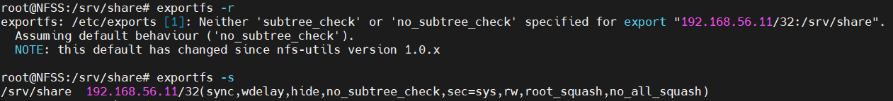


Далее переходим к настройке NFS клиента

Устанавливаем пакет с NFS-клиентом на вторую машину командой 

```bash
sudo apt install nfs-common
```

После чего добавляем в /etc/fstab строку с сервером NFS, командой

```bash
echo "192.168.56.10:/srv/share/ /mnt nfs vers=3,noauto,x-systemd.automount 0 0" >> /etc/fstab
```
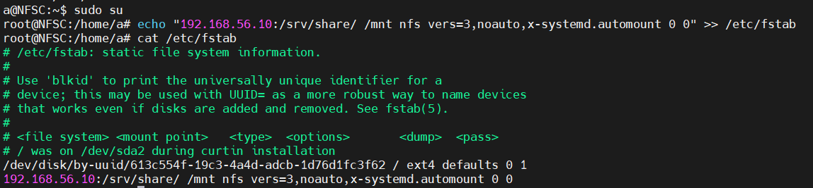

После добавления, выполняем команды 

```bash
systemctl daemon-reload
systemctl restart remote-fs.target
```

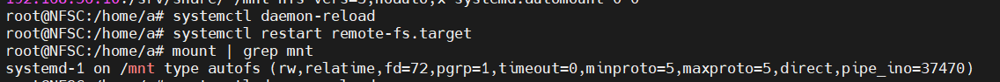

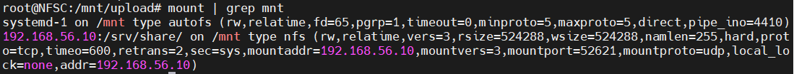

Также проверяем на клиенте директорию в /mnt

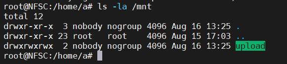


Через сервер клиента создаем файлы в примонтированной NFS директории 

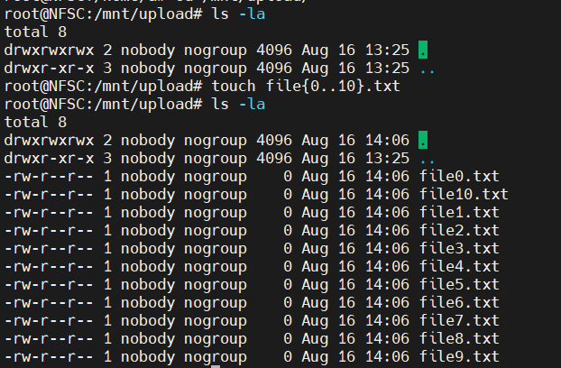

Ниже скрины проверки через WinSCP
На сервере клиента 

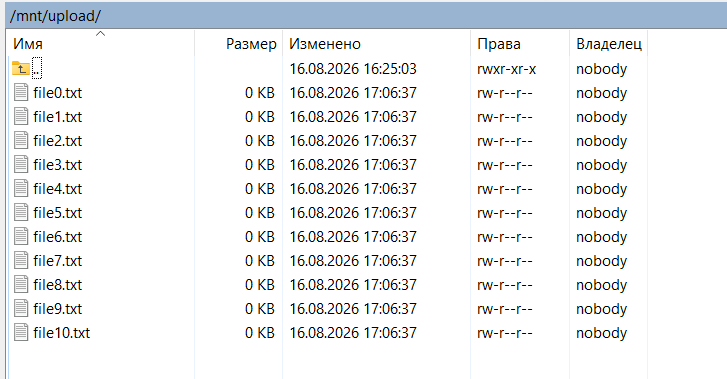

И NFS сервере 

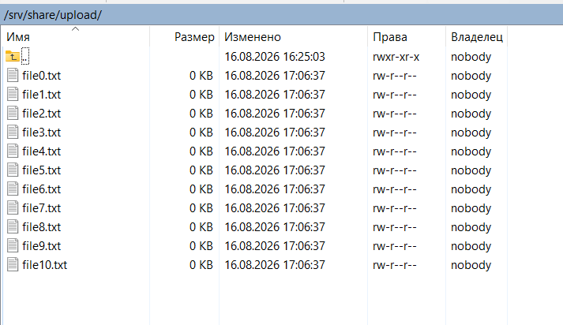


После этого выполняю рестарт клиента 

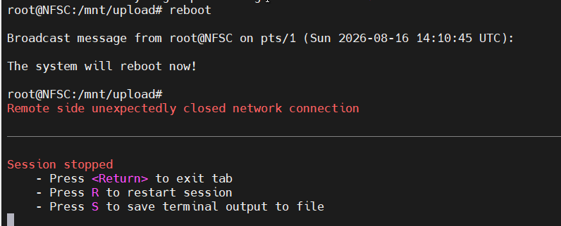

и проверяю, переподключился ли клиент к NFS серверу

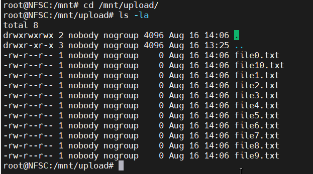

4) настроить аутентификацию через KERBEROS с использованием NFSv4

Для выполнения данного задания, для начала мы задаем hostname на серверах, командами 

```bash 
hostnamectl set-hostname nfss.lab.local
hostnamectl set-hostname nfsc.lab.local
```

После чего на серверах nfss и nfsc в /etc/hosts добавляем значения 

```bash 
192.168.56.10   nfss.lab.local nfss
192.168.56.11   nfsc.lab.local nfsc
```

Далее на двух серверах синхронизируем время, командами 

```bash 
timedatectl set-ntp true
timedatectl status
```

Далее приступаем к установке утилит, на сервер NFSS, командой 

```bash
apt install -y krb5-kdc krb5-admin-server krb5-config
```

после чего дополнил файл в директории /etc/krb5.conf, следующими полями

```bash
[libdefaults]
    default_realm = LAB.LOCAL
    dns_lookup_realm = false
    dns_lookup_kdc = false
    rdns = false
    ticket_lifetime = 24h
    forwardable = true

[realms]
    LAB.LOCAL = {
        kdc = nfss.lab.local
        admin_server = nfss.lab.local
    }

[domain_realm]
    .lab.local = LAB.LOCAL
    lab.local = LAB.LOCAL
```

Далее инициализируем krb5, командой 

```bash
krb5_newrealm
```

после чего выдал права администратора, изменив файл в директории /etc/krb5kdc/kadm5.acl, и генерируем keytab-файлы, командами:

```bash
kadmin.local -q "ktadd nfs/nfss.lab.local"
klist -k /etc/krb5.keytab

kadmin.local -q "ktadd -k /tmp/nfsc.keytab nfs/nfsc.lab.local"
scp /tmp/nfsc.keytab a@192.168.56.11:/tmp/
shred -u /tmp/nfsc.keytab
```

на клиенте выполняем команды

```bash 
cp /tmp/nfsc.keytab /etc/krb5.keytab
chown root:root /etc/krb5.keytab
chmod 600 /etc/krb5.keytab
shred -u /tmp/nfsc.keytab
klist -k /etc/krb5.keytab
```

Также выполняю настройки на клиенте, для начала установим пакет Kerberos, командой 

```bash 
apt install -y krb5-user
```

Далее выполняем настройку Kerberos на клиенте, для начала редактируем /etc/exports, меняем старое значение на следующее:

```
/srv/share  192.168.56.11(rw,sync,no_subtree_check,sec=krb5p)
```

После чего реэкспортируем новые конфиги 

```bash
exportfs -ra
```

после чего монтируем NFS директорию на стенд клиента, командой:

```bash
mount -t nfs -o sec=krb5p,vers=4.2 nfss.lab.local:/srv/share /mnt/nfs
```

В результате выполнения, мы получаем примонтированную директорию 
/mnt/nfs/upload с сервера NFS

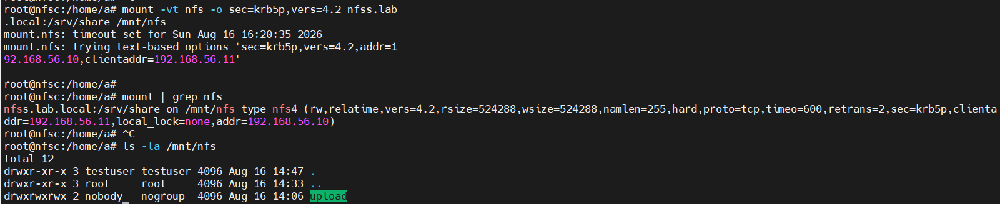