# Управление пакетами. Дистрибьюция софта

**Занятие 6.** Управление пакетами. Дистрибьюция софта

---

Задание

 - Создать свой RPM пакет (можно взять свое приложение, либо собрать, например, Apache с определенными опциями).
 - Создать свой репозиторий и разместить там ранее собранный RPM.

---

1) Создать свой RPM пакет (можно взять свое приложение, либо собрать, например, Apache с определенными опциями).

Перед началом работы, была развернута виртуальная машина на базе Ubuntu версии 24.04

Произвожу установку пакетов для выполнения задания, командой 

```bash
sudo apt install -y build-essential devscripts dpkg-dev debhelper fakeroot quilt dh-make wget curl git cmake nano gnupg apt-utils
sudo sed -i '/^Types: deb$/s/.*/Types: deb deb-src/' /etc/apt/sources.list.d/ubuntu.sources
sudo apt update
```

а так же создадим директорию для nginx и загрузим 

```bash
mkdir -p ~/build && cd ~/build
apt source nginx
sudo apt build-dep -y nginx
```

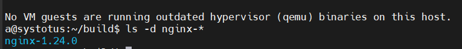

После этого производим сборку модуля nginx командами

```bash
git clone --recurse-submodules -j8 https://github.com/google/ngx_brotli modules/ngx_brotli
cd modules/ngx_brotli/deps/brotli
mkdir out && cd out
cmake -DCMAKE_BUILD_TYPE=Release -DBUILD_SHARED_LIBS=OFF \
  -DCMAKE_C_FLAGS="-Ofast -funroll-loops -ffunction-sections -fdata-sections -Wl,--gc-sections" \
  -DCMAKE_CXX_FLAGS="-Ofast -funroll-loops -ffunction-sections -fdata-sections -Wl,--gc-sections" \
  -DCMAKE_INSTALL_PREFIX=./installed ..
cmake --build . --config Release -j "$(nproc)" --target brotlienc
```

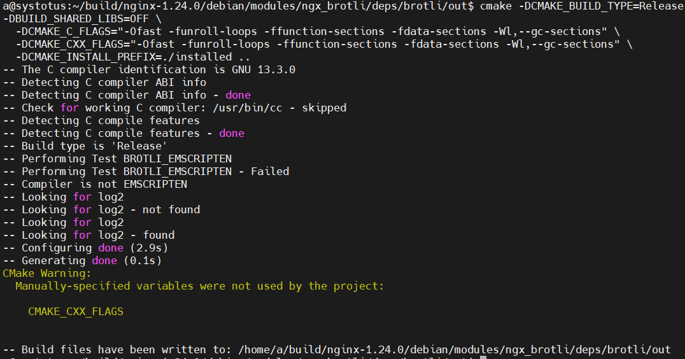

Дальше добавляем следующую строку в spec 

```bash
--add-module=$(CURDIR)/debian/modules/ngx_brotli \
```

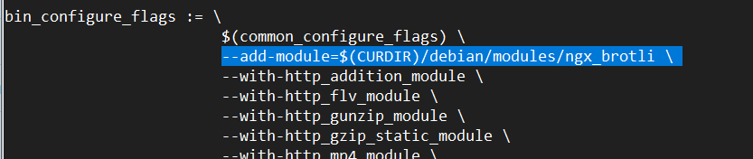

Так же повышаем версию пакета, иначе APT будет считаьб собираемый пакет идентичным архивному:

```bash 
dch --local ~otus1 "Rebuild with ngx_brotli module"
```

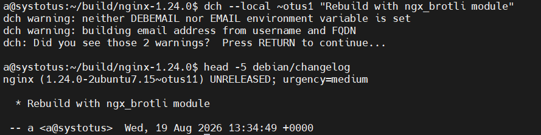

Дальше проверяем собранный пакет 

```bash 
ls -l ../*.deb
```

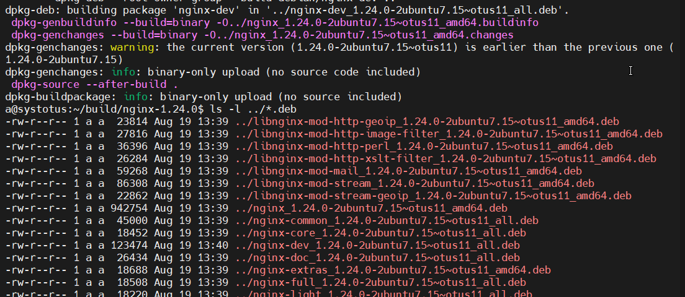

И после проверяем результат выполненной работы, следующими командами 

```bash
cd ~/build
sudo apt install ./nginx_*.deb ./nginx-common_*.deb ./libnginx-mod-*.deb
nginx -V 2>&1 | tr ' ' '\n' | grep -i brotli
sudo systemctl enable --now nginx
systemctl status nginx
```

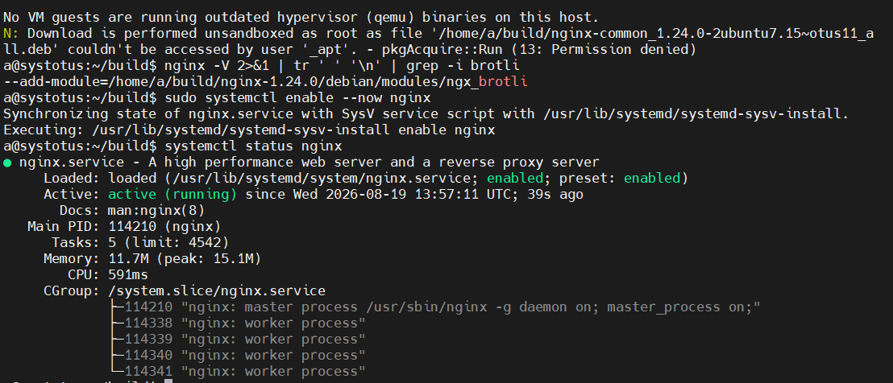


2) Создать свой репозиторий и разместить там ранее собранный RPM

После сборки пакета, создаем свой репозиторий, команды

```bash
sudo mkdir -p /var/www/html/repo/pool
sudo cp ~/build/*.deb /var/www/html/repo/pool/
```

так же генерируем метаданные 

```bash 
sudo bash -c 'dpkg-scanpackages --multiversion pool /dev/null > Packages'
sudo bash -c 'gzip -9c Packages > Packages.gz'
sudo bash -c 'apt-ftparchive release . > Release'
```

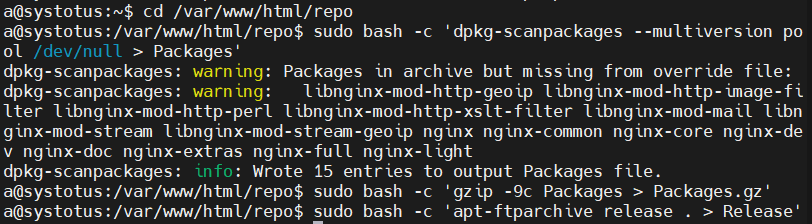

После генерации метаданных, подписываем репозиторий команлами:

```bash
gpg --batch --gen-key <<EOF
%no-protection
Key-Type: RSA
Key-Length: 4096
Name-Real: OTUS Repo
Name-Email: repo@otus.local
Expire-Date: 0
EOF

cd /var/www/html/repo
sudo -E bash -c 'gpg --default-key repo@otus.local --clearsign -o InRelease Release'
sudo -E bash -c 'gpg --default-key repo@otus.local -abs -o Release.gpg Release'
sudo mkdir -p /etc/apt/keyrings
gpg --export repo@otus.local | sudo tee /etc/apt/keyrings/otus.gpg > /dev/null
```

Так же в /etc/nginx/sites-enabled/default, в блоке location добавляем:

```bash
autoindex on;
autoindex_exact_size off;
```

и выполняем следующие команды и тут же проверяем результат:

```bash
sudo nginx -t && sudo nginx -s reload
curl -s http://localhost/repo/ | head
```

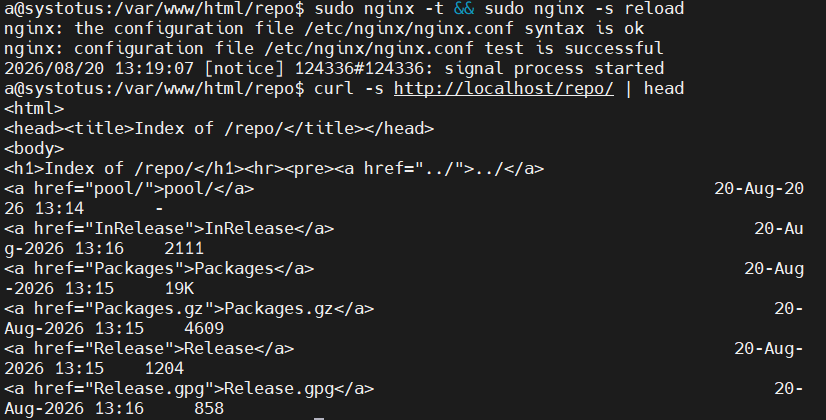

Так же можно проверить командой 

```bash
lynx http://localhost/repo/
```

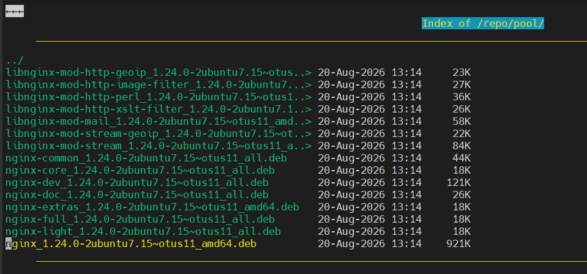

После этого подключаемся к репозиторию командами

```bash
sudo tee /etc/apt/sources.list.d/otus.sources > /dev/null <<EOF
Types: deb
URIs: http://localhost/repo
Suites: ./
Signed-By: /etc/apt/keyrings/otus.gpg
EOF

sudo apt update
apt policy | grep -A1 otus
apt-cache madison nginx
apt policy nginx
```

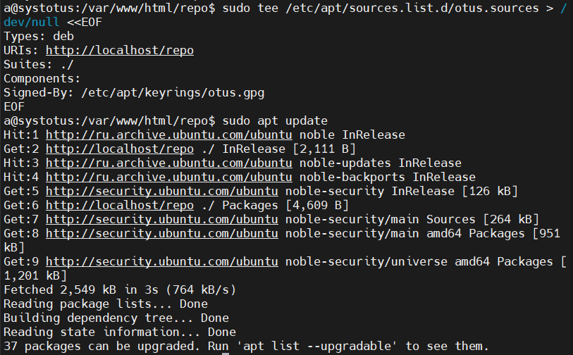

Добавляем собранный пакет из репозитория командами 

```bash 
sudo bash -c 'dpkg-scanpackages --multiversion pool /dev/null > Packages'
sudo bash -c 'gzip -9c Packages > Packages.gz'
sudo bash -c 'apt-ftparchive release . > Release'
sudo rm -f InRelease Release.gpg
sudo -E bash -c 'gpg --default-key repo@otus.local --clearsign -o InRelease Release'
sudo apt update
```

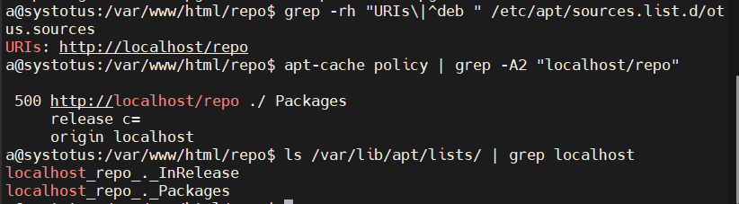

После чего выполняем команду:

```bash
sudo apt install -y percona-release
```
для установки собранного пакета из личного репозитория

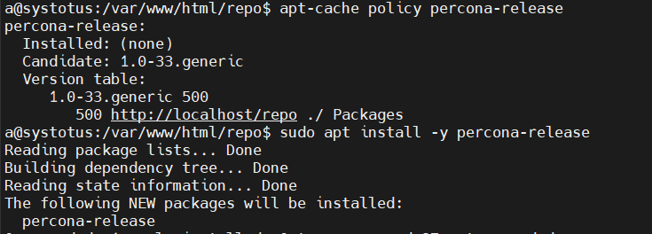