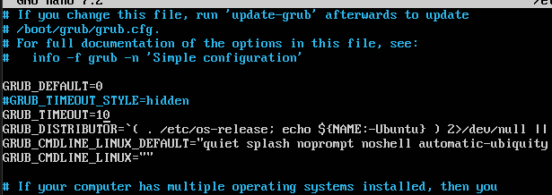
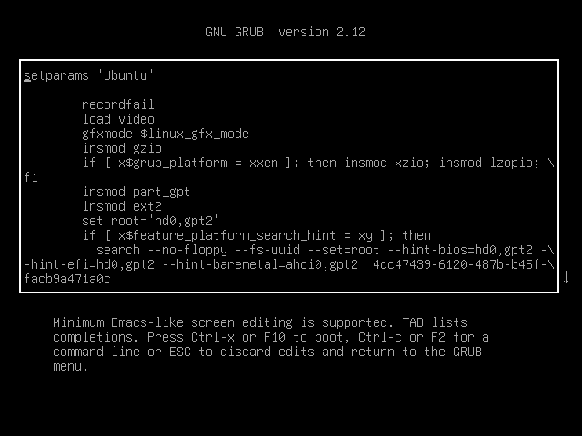
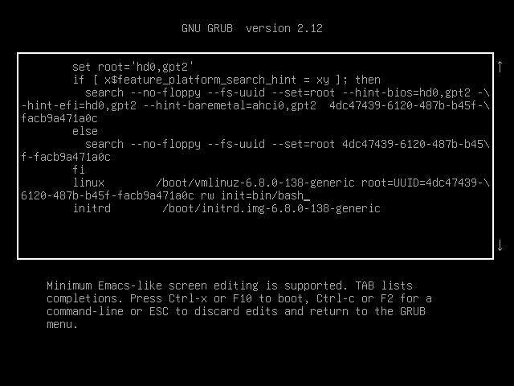
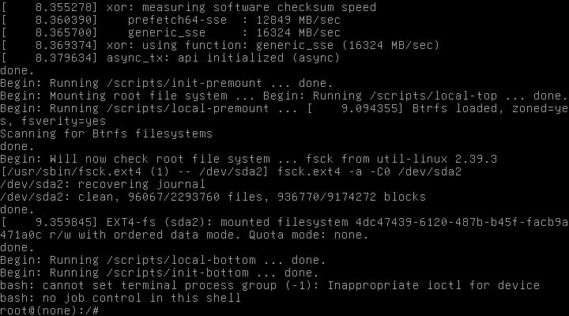
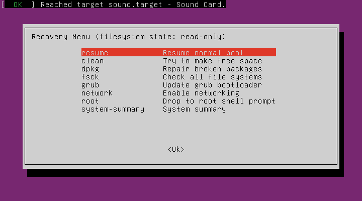
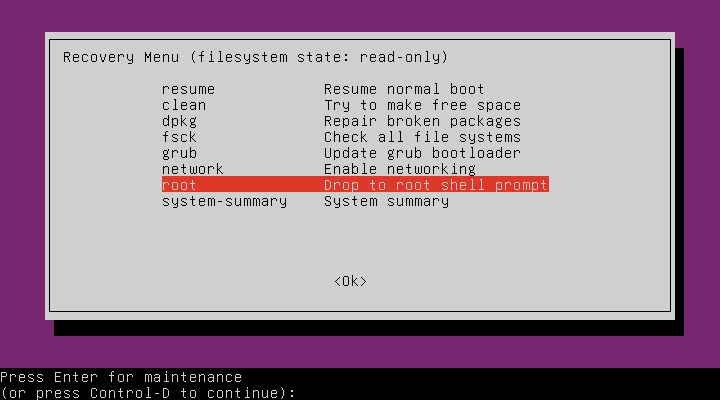
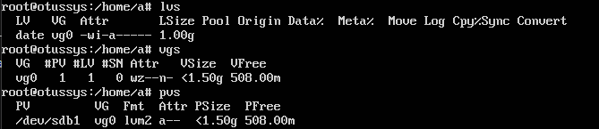
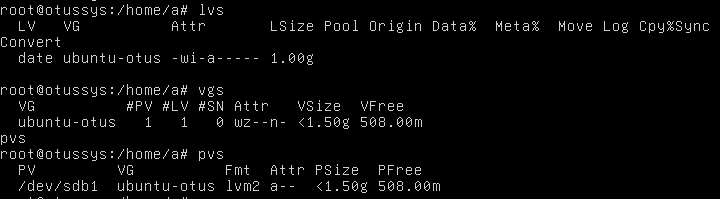

# Загрузка системы

**Занятие 6.** Загрузка системы

---

Задание. 
 - Включить отображение меню Grub.
 - Попасть в систему без пароля несколькими способами.
 - Установить систему с LVM, после чего переименовать VG.

---

1) Включить отображение меню Grub.

Для выполнения данного, задания, скорректируем файл в директории /etc/default/grub



после чего обновляем конфигурацию и перезагружаем систему командами:

```bash
update-grub
reboot
```

2) Попасть в систему без пароля несколькими способами.

После рестарта системы, на загрузочном экране нажимаем кнопку E, тем самым попадаем в параметры загрузки



Правим строку linux следующим образом



В результате, после нажатия Ctrl+x



Так же подключимся вторым способом, через меню востановления 





3) Установить систему с LVM, после чего переименовать VG.

Перед выполнением, создадим LVM



Далее выполняем команду 

```bash 
vgrename vg0 ubuntu-otus
```

После чего проверяем изменения

